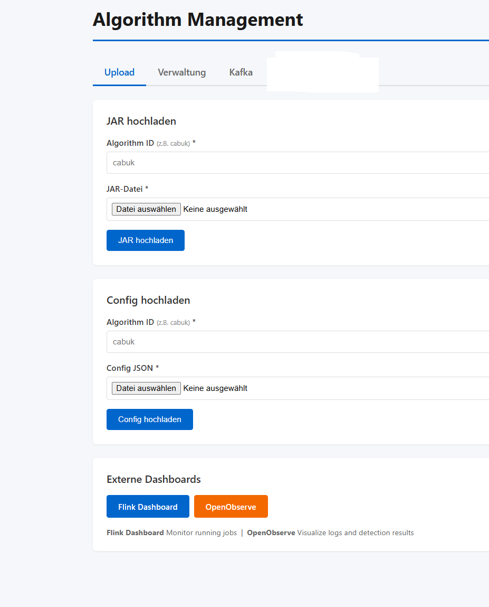
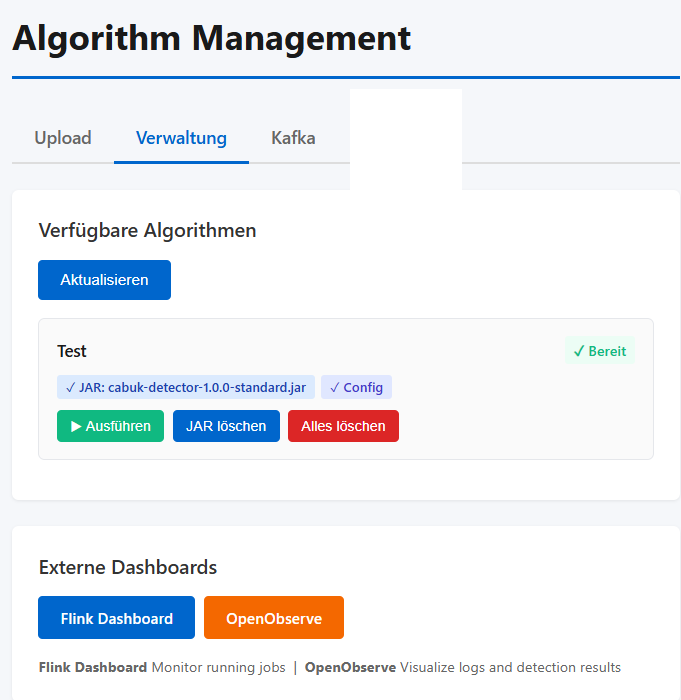

# CEPHA Quickstart
**CEPHA** (Covert channel Examination, Packet based Hidden channel Analysis), a modular, plugin framework that supports dynamic JAR deployment for network covert-channel detection algorithms.

Everything you need to get a local CEPHA instance running and your own detection algorithm deployed against it self-contained in this one document.

For distributed deployment and the full REST API reference, see the [CEPHA Deployment Guide](docs/CEPHA_Deployment_Guide.md) and [CEPHA Plugin Development Guide](docs/CEPHA_Plugin_Development_Guide.md).

## Contents

1. [Start the local stack](#1-start-the-local-stack)
2. [Build a detection plugin](#2-build-a-detection-plugin)
3. [Deploy and run your plugin via the Web UI](#3-deploy-and-run-your-plugin-via-the-web-ui)
4. [config.json full key reference](#4-configjson--full-key-reference)

---

## 1. Start the local stack

Download the File

[ deploy/compose/docker-compose.localnodes.yml](https://github.com/Xetgatgram/CEPHA/blob/main/deploy/compose/docker-compose.jobmanager.yml)


or Check-out the whole Project.

```bash
git clone https://github.com/Xetgatgram/CEPHA.git
cd CEPHA
```

Before starting, adjust the two host-specific bind-mount paths in `docker-compose.localnodes.yml`:
- PCAP upload directory (`framework` service)
- Kafka persistent log storage (`kafka` service)

Then start everything:

```bash
docker compose -f docker-compose.localnodes.yml up -d
```

Open the Web UI at `http://localhost:8080` once the containers report healthy.

---

## 2. Build a detection plugin

You do **not** need to clone this repository to write a plugin. The `detection-api` module is resolved directly from GitHub via [JitPack](https://jitpack.io)  no separate package registry, no login required.

The example below implements the **Buffered Window** path with a tumbling time window: the framework buffers every packet that arrives within a fixed-duration window, calls `processFlow()` once per buffered packet when the window closes, then calls `detect()` once for that window. See [Section 4](#4-configjson--full-key-reference) for the other window types and the Feature-Based Window path.

### 2.1 `pom.xml`

Standalone Maven module — no parent POM, builds independently of the CEPHA repository.

```xml
<?xml version="1.0" encoding="UTF-8"?>
<project xmlns="http://maven.apache.org/POM/4.0.0"
         xmlns:xsi="http://www.w3.org/2001/XMLSchema-instance"
         xsi:schemaLocation="http://maven.apache.org/POM/4.0.0
         http://maven.apache.org/xsd/maven-4.0.0.xsd">
    <modelVersion>4.0.0</modelVersion>

    <groupId>com.example</groupId>
    <artifactId>my-covert-channel-detector</artifactId>
    <version>1.0.0</version>
    <packaging>jar</packaging>

    <name>My Covert Channel Detector</name>
    <description>Independent CEPHA detection plugin</description>

    <properties>
        <maven.compiler.source>17</maven.compiler.source>
        <maven.compiler.target>17</maven.compiler.target>
        <project.build.sourceEncoding>UTF-8</project.build.sourceEncoding>
    </properties>

    <!-- JitPack resolves the detection-api artifact directly from the CEPHA GitHub repo. -->
    <repositories>
        <repository>
            <id>jitpack.io</id>
            <url>https://jitpack.io</url>
        </repository>
    </repositories>

    <dependencies>
        <dependency>
            <groupId>com.github.Xetgatgram.CEPHA</groupId>
            <artifactId>detection-api</artifactId>
            <version>v1.0.0</version>
            <scope>provided</scope>
        </dependency>

        <!-- pcap4j: also provided by the framework runtime -->
        <dependency>
            <groupId>org.pcap4j</groupId>
            <artifactId>pcap4j-core</artifactId>
            <version>1.8.2</version>
            <scope>provided</scope>
        </dependency>
        <dependency>
            <groupId>org.pcap4j</groupId>
            <artifactId>pcap4j-packetfactory-static</artifactId>
            <version>1.8.2</version>
            <scope>provided</scope>
        </dependency>

        <dependency>
            <groupId>org.slf4j</groupId>
            <artifactId>slf4j-api</artifactId>
            <version>2.0.7</version>
        </dependency>
    </dependencies>

    <build>
        <plugins>
            <!-- Produces the plain jar containing only your plugin's own classes. -->
            <plugin>
                <groupId>org.apache.maven.plugins</groupId>
                <artifactId>maven-jar-plugin</artifactId>
                <version>3.4.1</version>
            </plugin>
        </plugins>
    </build>
</project>
```


### 2.2 `MyBufferedWindowDetector.java`

Save under `src/main/java/com/example/detector/MyBufferedWindowDetector.java`.

```java
package com.example.detector;

import com.covertchannel.framework.api.DetectionAlgorithm;
import com.covertchannel.framework.api.FrameworkConfig;
import com.covertchannel.processor.DetectionResult;
import com.covertchannel.processor.NetworkPacket;

/**
 * Buffered Window detection plugin (tumbling time window).
 *
 * Selected by config.json: windowType = "tumbling", supportsFeatureExtraction()
 * left at its default (false). The framework buffers every NetworkPacket that
 * arrives within the window and calls processFlow() once per buffered packet
 * when the window closes, followed by a single detect() call for that window.
 */
public class MyBufferedWindowDetector implements DetectionAlgorithm {

    private static final long serialVersionUID = 1L;

    private double threshold;
    private int packetCount;

    @Override
    public void initialize(FrameworkConfig config) {
        this.threshold = config.getDouble("threshold", 1.0);
        this.packetCount = 0;
    }

    @Override
    public void processFlow(NetworkPacket packet) {
        // Called once per buffered packet when the window closes -
        // NOT once per arriving packet as in the Per-Packet path.
        packetCount++;
    }

    @Override
    public DetectionResult detect() throws Exception {
        // Called once per window, after all buffered packets have been
        // passed to processFlow().
        boolean isAnomaly = packetCount > threshold;

        DetectionResult result = new DetectionResult("my-buffered-detector", "flow-id");
        result.addDetail("packetCount", packetCount);
        result.addDetail("anomaly", isAnomaly);
        return result;
    }

    @Override
    public void resetAfterWindow() {
        // Called by the framework after each window is processed.
        // Without this, packetCount would keep accumulating across windows
        // instead of being scoped to a single window.
        packetCount = 0;
    }

    @Override
    public void close() {
        // Release any resources here; called once when the job stops.
    }
}
```

### 2.3 `config.json`

Upload separately (see [Section 3](#3-deploy-and-run-your-plugin-via-the-web-ui)).

```json
{
  "algorithmClassName": "com.example.detector.MyBufferedWindowDetector",
  "inputTopic": "network-flows",
  "executionMode": "REPLAY",
  "windowType": "tumbling_count",
  "windowCount": 2000,
  "threshold": 1.0
  
}
```

### 2.4 Build the plugin JAR

```bash
mvn clean package
```

This produces `target/my-covert-channel-detector-1.0.0.jar`, ready to upload.

---

## 3. Deploy and run your plugin via the Web UI

Open `http://localhost:8080`. The **Algorithm Management** UI lets you:

- upload your plugin JAR and `config.json` under an algorithm ID
- list registered algorithms and their upload status
- start a detection job for a given algorithm

### 3.1 Upload the JAR and config


### 3.2 Start the job



### Equivalent REST calls

If you prefer the command line over the UI:

```bash
curl -X POST http://localhost:8080/api/algorithms/upload-jar/my-buffered-detector \
  -F "jar=@target/my-covert-channel-detector-1.0.0.jar"

curl -X POST http://localhost:8080/api/algorithms/upload-config/my-buffered-detector \
  -F "config=@config.json"

curl -X POST http://localhost:8080/api/algorithms/my-buffered-detector/execute
```

---

## 4. config.json full key reference

### Framework-reserved keys

| Key | Type | Required | Default | Notes |
|---|---|---|---|---|
| `algorithmClassName` | String | Yes | — | Fully qualified class name of the plugin entry point. Loaded from the JAR via `URLClassLoader`. |
| `inputTopic` | String | Yes | — | Kafka input topic. |
| `executionMode` | String | No | `STREAMING` | `STREAMING` (unbounded, never closes) \| `BATCH` (bounded, terminates) \| `REPLAY` (bounded, streaming semantics, terminates). |
| `windowType` | String | No | `tumbling` | `none` (Per-Packet path) \| `tumbling` \| `sliding` \| `session` \| `tumbling_count` \| `sliding_count`. |
| `windowSizeMs` | long | Required for `tumbling`, `sliding`, `session` | — | Window size in ms. For `session`, the pause duration that closes the window. |
| `slideMs` | long | Required for `sliding` | — | Slide interval in ms. |
| `windowCount` | long | Required for `tumbling_count`, `sliding_count` | — | Window size in number of packets. |
| `slideCount` | long | Required for `tumbling_count`, `sliding_count` | — | Slide step in packets. `0` or equal to `windowCount` = tumbling behaviour. Must not exceed `windowCount`. |
| `parallelism` | int | No | cluster default | Flink operator parallelism. |
| `partialFlush` | boolean | No | `false` | `BATCH` mode + count-based windows only: flush an incomplete window at stream end instead of discarding it. No effect otherwise. |
| `kafkaBrokers` | String | No | — | Read back by the framework into `FrameworkConfig`; typically not required to set manually in local/distributed deployments. |

### Algorithm-specific keys

Any additional key (e.g. `threshold` in the example above) is passed through untouched and read inside your plugin via `FrameworkConfig`:

```java
config.getString(key, default);
config.getInt(key, default);
config.getDouble(key, default);
config.getBoolean(key, default);
config.get(key);
```

### Annotated example (all keys, for reference only)

`//` comments are **not** valid JSON — this block is for reading only. Use the parseable `config.json` in [Section 2.3](#23-configjson) as your actual starting point.

```json
{
  // ── Required ──────────────────────────────────────────────────
  "algorithmClassName": "com.example.MyDetector",   // Fully qualified class name
  "inputTopic":     "network-packets",           // Kafka input topic

  // ── Execution Mode ────────────────────────────────────────────
  // STREAMING (default) | BATCH | REPLAY
  "executionMode":  "STREAMING",

  // ── Window Type ───────────────────────────────────────────────
  // none | tumbling | sliding | session | tumbling_count | sliding_count
  "windowType":     "tumbling",

  // ── Time-Based Windows (tumbling / sliding / session) ─────────
  "windowSizeMs":   60000,    // Window size in milliseconds (required)
  "slideMs":        30000,    // Slide interval in ms (sliding only)

  // ── Count-Based Windows (tumbling_count / sliding_count) ──────
  "windowCount":    128,      // Window size in packets (required)
  "slideCount":     0,        // Slide step; 0 = tumbling behaviour

  // ── Optional ──────────────────────────────────────────────────
  "parallelism":    2,        // Flink operator parallelism (default: cluster default)
  "partialFlush":   false,    // Flush incomplete count windows at stream end (BATCH only)

  // ── Algorithm-Specific Keys ───────────────────────────────────
  "myThreshold":    0.75,
  "myWindowParam":  512
}
```

### Processing path selection

The framework picks one of three processing paths based on `windowType` and `supportsFeatureExtraction()`:

| Path | `windowType` | `supportsFeatureExtraction()`                        | Method called |
|---|---|------------------------------------------------------|---|
| Per-Packet | `none` | not evaluated                                        | `processFlow(packet)` once per arriving packet |
| Buffered Window | any windowed value | `false` (default) - used by the example in Section 2 | `processFlow(packet)` once per buffered packet at window close |
| Feature-Based Window | any windowed value | `true`                                               | `processFlowFeatures(features)` once per buffered feature set at window close |

See the [CEPHA Plugin Development Guide](docs/CEPHA_Plugin_Development_Guide.md), Section 5, for the other window types (sliding, session, tumbling_count, sliding_count) and for the Feature-Based Window path.

---

## Next steps

- Verifying Flink, Kafka, and the observability stack: [CEPHA Deployment Guide, Chapter 5](docs/CEPHA_Deployment_Guide.md)
- Distributed (multi-node) deployment via Ansible: [CEPHA Deployment Guide, Chapter 4](docs/CEPHA_Deployment_Guide.md)
- Feature-Based Window path and other window types: [CEPHA Plugin Development Guide](docs/CEPHA_Plugin_Development_Guide.md)
