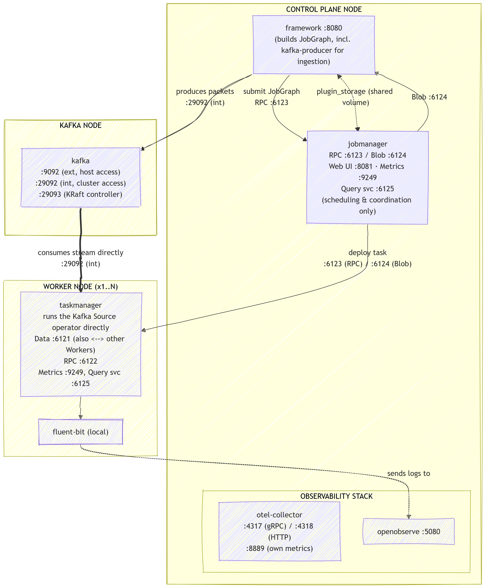

# CEPHA Deployment Guide

## Table of Contents

- [Chapter 1: Introduction](#chapter-1-introduction)
  - [1.1 Purpose of this Document](#11-purpose-of-this-document)
  - [1.2 Target Audience and Prerequisites](#12-target-audience-and-prerequisites)
  - [1.3 Deployment Paths at a Glance](#13-deployment-paths-at-a-glance)
  - [1.4 Repository and Image Registry](#14-repository-and-image-registry)
- [Chapter 2: Architecture and Service Topology](#chapter-2-architecture-and-service-topology)
  - [2.1 System Overview](#21-system-overview)
  - [2.2 Service Groups and Compose Files](#22-service-groups-and-compose-files)
  - [2.3 Inter-Service Communication](#23-inter-service-communication)
  - [2.4 Volume Architecture](#24-volume-architecture)
  - [2.5 Port Reference](#25-port-reference)
  - [2.6 Image Inventory](#26-image-inventory)
  - [2.7 Environment Variable Reference](#27-environment-variable-reference)
- [Chapter 3: Local Deployment](#chapter-3-local-deployment)
  - [3.1 Overview](#31-overview)
  - [3.2 Prerequisites](#32-prerequisites)
  - [3.3 Starting the Stack](#33-starting-the-stack)
  - [3.4 Verifying the Deployment](#34-verifying-the-deployment)
- [Chapter 4: Distributed Deployment](#chapter-4-distributed-deployment)
  - [4.1 Overview](#41-overview)
  - [4.2 Prerequisites](#42-prerequisites)
  - [4.3 Inventory Configuration](#43-inventory-configuration)
    - [4.3.1 Host Addresses](#431-host-addresses)
    - [4.3.2 Credentials and Secrets](#432-credentials-and-secrets)
  - [4.4 Deploying the Stack](#44-deploying-the-stack)
  - [4.5 Verifying the Deployment](#45-verifying-the-deployment)
- [Chapter 5: Verification Procedures](#chapter-5-verification-procedures)
  - [5.1 Flink Cluster State](#51-flink-cluster-state)
  - [5.2 Kafka Connectivity](#52-kafka-connectivity)
  - [5.3 Observability Stack](#53-observability-stack)

---

## Chapter 1: Introduction

### 1.1 Purpose of this Document

This document describes the deployment of CEPHA (Covert channel Examination, Packet based Hidden channel Analysis), a modular, plugin-based framework for the detection of network covert channels. It covers all deployment topologies supported by the framework, from a single-host evaluation setup to a distributed multi-node configuration, and provides a complete reference for all environment variables, port assignments, and configuration files required to operate the system.

The document is self-contained. A reader unfamiliar with the project can deploy a fully operational CEPHA instance based solely on the instructions provided here.

Architecture-level internals, data model definitions, and plugin lifecycle mechanics are covered in the CEPHA Technical Reference, not in this document.

---

### 1.2 Target Audience and Prerequisites

The primary audience for this document is researchers and computer scientists who intend to deploy CEPHA for experimental use, evaluation, or framework extension.

The following knowledge is assumed:

- Docker and Docker Compose: service definitions, volume mounts, environment variables, and basic `docker compose` commands
- Ansible basics: inventories, playbooks, and Ansible Vault, required only for the distributed deployment path (Chapter 4)
- Command line operation: executing shell commands on a Linux-based host
- Network basics: understanding of ports, inter-host connectivity, and firewall rules

The following knowledge is helpful but not required:

- Apache Flink cluster architecture
- Apache Kafka administration
- Maven multi-module build structure

---

### 1.3 Deployment Paths at a Glance

CEPHA supports two deployment paths.

| Path | Description | Starting point |
|---|---|---|
| Local Deployment | Full CEPHA stack on a single host via Docker Compose. For functional evaluation, algorithm development, and integration testing. All services communicate over Docker's internal network. | Chapter 3 |
| Distributed Deployment | CEPHA across multiple dedicated nodes via Ansible. For performance measurements and realistic experimental setups. Each service group runs on a separate host. | Chapter 4 |

Plugin development, implementing custom detection algorithms against the `detection-api` contract, does not require either deployment path and does not require access to the framework source. The `detection-api` module is published independently as a Maven package. See the CEPHA Plugin Development Guide for the full workflow.

---

### 1.4 Repository and Image Registry

The source code and all Docker Compose files are maintained in the CEPHA GitHub repository.

```text
https://github.com/Xetgatgram/CEPHA.git
```

Pre-built container images are published to the GitHub Container Registry under the same organisation. Both the repository and the images are public. No authentication is required to clone the repository or to pull the images.

```text
ghcr.io/CEPHA_ORG/cepha-rest:CEPHA_VERSION
ghcr.io/CEPHA_ORG/cepha-manager:CEPHA_VERSION
ghcr.io/CEPHA_ORG/cepha-fluent-bit:CEPHA_VERSION
```

The `cepha-manager` image serves both the JobManager and the TaskManager role. The role is determined by the `command` argument passed in the Compose file, not by the image itself (see Section 2.6).

---

## Chapter 2: Architecture and Service Topology

### 2.1 System Overview

CEPHA is composed of four functionally distinct service groups: the Control Plane, the Kafka Node, one or more Worker Nodes, and the Observability Stack. In the local single-node deployment, all groups are co-located on a single host. In the distributed deployment, each group is assigned to a dedicated node and communicates over a shared network.

The following diagram illustrates the logical topology of the distributed deployment, including all inter-service communication paths.



> Note: All service-to-service Kafka connections in the current codebase use the internal broker listener on port `29092`, not the external listener on `9092`. Port `9092` is reserved for access from outside the Docker network (external tooling, manual `kafka-topics` calls from the host). See Section 2.3 for details.
>
> Note: The JobManager coordinates job scheduling, checkpointing, and the Web UI. It does not sit on the data path. Once a detection job is deployed, each TaskManager opens its own Kafka consumer connection directly to the Kafka Node (`KafkaSource`, internal listener `:29092`) and streams packets independently. The JobManager to TaskManager link shown above (`:6123`/`:6124`) is the control channel used to deploy and coordinate tasks, not a data channel.

---

### 2.2 Service Groups and Compose Files

Each Compose file corresponds to one node role in the distributed deployment. The same Compose file is deployed on every host that assumes that role. All Compose files are maintained under `deploy/compose/` in the repository.

| Compose file | Node role | Services |
| --- | --- | --- |
| `docker-compose.localnodes.yml` | Local single-node | All services |
| `docker-compose.jobmanager.yml` | Control Plane | `jobmanager`, `framework`, `openobserve`, `otel-collector` |
| `docker-compose.kafka.yml` | Kafka Node | `kafka` |
| `docker-compose.taskmanager.yml` | Worker Node | `taskmanager`, `fluent-bit` |

The local single-node Compose file is for evaluation and development only. It simulates the full distributed topology on a single machine and is not suitable for performance measurements or production use. Because all TaskManager instances run on one host, the local Compose file gives every per-TaskManager results volume a unique, node-suffixed name (`flink_results_tm1`, `flink_results_tm2`, `flink_results_tm3`). This distinction does not exist in the distributed deployment, where each Worker Node has its own independent Docker volume namespace and the plain name `flink_results` is reused on every Worker Node without conflict (see Section 2.4). 

> Note: Especially in the local setup, it is preferable to increase the task slots or parallelism of a single TaskManager instead of using multiple TaskManagers, due to the coordination traffic that increases with multiple TaskManagers.

---

### 2.3 Inter-Service Communication

Control Plane to Worker Nodes

A TaskManager establishes an RPC connection to the JobManager on port `6123` at startup. The JobManager distributes the JobGraph and all required JARs to the TaskManager via the Blob Server on port `6124`. TaskManagers exchange intermediate operator results with each other directly over port `6121`, without routing data through the JobManager.

Control Plane to Kafka Node

The `framework` service connects to Kafka using the environment variable `KAFKA_BOOTSTRAPSERVERS`, set to the Kafka node's internal listener address on port `29092` (for example `kafka:29092` in the local topology, `<KAFKA_IP>:29092` in the distributed topology). This value is consumed by two independent code paths: Spring Binding for administrative operations (`KafkaAdminService`, via `application.yml`'s `bootstrap-servers: ${KAFKA_BOOTSTRAPSERVERS:kafka:29092}`), and `System.getenv("KAFKA_BOOTSTRAPSERVERS")` directly inside `AlgorithmJobFactory` for constructing the Flink `KafkaSource`. Both paths read the same variable. The Flink job running on the TaskManagers connects to Kafka using this same bootstrap address, passed through as part of the job configuration at submission time.

> Note: `KAFKA_BOOTSTRAPSERVERS` is the only Kafka address variable read by the current codebase. If it is absent, `AlgorithmJobFactory` falls back to the `kafkaBrokers` field in the plugin's `config.json`.

Observability paths

Flink metrics are exposed via the Prometheus Reporter on port `9249` on both the JobManager and each TaskManager. The OTel Collector scrapes these endpoints and forwards the data to OpenObserve via the OTLP HTTP interface on port `4318` (configured in `otel-collector-config.yml`. The collector also exposes its own Prometheus metrics on port `8889` for external monitoring of the collector itself). Detection result files written by the TaskManagers are forwarded to OpenObserve by a dedicated Fluent Bit instance co-located on each Worker Node.

> Note: The OTel Collector configuration statically defines scrape targets for `TASKMANAGER1_HOST` through `TASKMANAGER3_HOST`. If fewer than three Worker Nodes are active, for example in the default local single-TaskManager setup, the collector logs scrape failures for the missing targets. This is expected and does not affect metrics collection from the active TaskManagers. The scrape targets are defined in `otel-collector-config.yml` (`targets: ['${env:TASKMANAGER1_HOST}:9249']`, and analogously for `TASKMANAGER2_HOST`/`TASKMANAGER3_HOST`). Scrape jobs can be added, removed, or repointed there to match the actual number of Worker Nodes.

---

### 2.4 Volume Architecture

The following named Docker volumes are defined across the deployment. All volumes are local to the node on which they are created. No cross-node volume sharing is required.

| Volume | Node | Shared between | Purpose |
| --- | --- | --- | --- |
| `plugin_storage` | Control Plane | `framework`, `jobmanager` | Plugin JARs uploaded via the REST API. Read by the JobManager at job submission |
| `flink_results` | Worker Node (each) | `taskmanager`, `fluent-bit` | Detection result files written by the TaskManager. Read by the co-located Fluent Bit |
| `flink_dlq` | Control Plane and each Worker Node | `jobmanager`/`taskmanager`, via `CEPHA_DLQ_PATH` | Dead letter storage for records that cannot be processed |
| `openobserve_data` | Control Plane | `openobserve` | Persistent storage for OpenObserve |
| `kafka_data` | Kafka Node | `kafka` | Persistent Kafka log storage |

The `plugin_storage` volume is the critical shared mount on the Control Plane. Uploaded plugin JARs are written to this volume by the REST API and read directly by the JobManager at job submission time via the Blob Server.

In the local single-node Compose file, `plugin_storage`, `flink_dlq`, `kafka_data`, and `openobserve_data` are shared exactly as described above. The `flink_results` volume is split into node-suffixed volumes (`flink_results_tm1/2/3`) purely because all TaskManagers run on the same Docker host and would otherwise collide on the same volume name (see Section 2.2). This local-only naming difference does not apply to the distributed deployment.

The `framework` container also mounts a PCAP upload directory (`kafka.producer.pcap-upload-dir`, default `/pcap-files`) from a host path, used as the temporary landing zone for PCAP files submitted through the producer REST endpoint. This is a bind mount to a host directory, not a named Docker volume, and its host-side path must be adjusted per deployment (see Section 2.7).

---

### 2.5 Port Reference

All ports use TCP. The table below distinguishes between ports accessible from outside the Docker network (browser, external tools) and ports used exclusively for internal inter-service communication.

Control Plane Node

| Port | Service | Access | Accessed by |
| --- | --- | --- | --- |
| `8080` | `framework` | External | Browser, `curl`, GUI based operational checks |
| `8081` | `jobmanager` | External | Browser |
| `5080` | `openobserve` | External | Browser, OTel Collector (ingest) |
| `4317` | `otel-collector` | Internal | OTLP gRPC receiver (not actively used by the current Prometheus scrape pipeline, but exposed) |
| `4318` | `otel-collector` | Internal | OTLP HTTP receiver used by the collector's own export path |
| `8889` | `otel-collector` | External | Prometheus metrics of the collector itself |
| `6123` | `jobmanager` | Internal | TaskManagers to JobManager (RPC) |
| `6124` | `jobmanager` | Internal (also externally mapped for debugging) | TaskManagers from JobManager (Blob Server, JAR distribution) |
| `6125` | `jobmanager` | Internal | Internal metrics query service |
| `9249` | `jobmanager` | Internal | OTel Collector (Prometheus scrape) |

Kafka Node

| Port | Service | Access | Accessed by |
| --- | --- | --- | --- |
| `9092` | `kafka` | External | Manual/external Kafka clients, host level tooling |
| `29092` | `kafka` | Internal | `framework`, Flink TaskManagers. The address used by all in cluster service connections |
| `29093` | `kafka` | Internal | KRaft controller listener |

Worker Node

| Port | Service | Access | Accessed by |
|---|---|---|---|
| `6121` | `taskmanager` | Internal | Other TaskManagers (data exchange) |
| `6122` | `taskmanager` | Internal | JobManager (TaskManager RPC) |
| `6125` | `taskmanager` | Internal | Internal metrics query service |
| `9249` | `taskmanager` | Internal | OTel Collector on Control Plane (Prometheus scrape) |

---

### 2.6 Image Inventory

The following container images are required to operate CEPHA. Images marked CEPHA are published to the GitHub Container Registry and are public. Images marked External are pulled directly from public registries and require no prior authentication either.

| Image | Source | Used on |
| --- | --- | --- |
| `ghcr.io/CEPHA_ORG/cepha-rest:CEPHA_VERSION` | CEPHA | Control Plane |
| `ghcr.io/CEPHA_ORG/cepha-manager:CEPHA_VERSION` | CEPHA | Control Plane (JobManager role), Worker Nodes (TaskManager role) |
| `ghcr.io/CEPHA_ORG/cepha-fluent-bit:CEPHA_VERSION` | CEPHA | Worker Nodes |
| `confluentinc/cp-kafka:7.5.0` | External | Kafka Node |
| `otel/opentelemetry-collector-contrib:latest` | External | Control Plane |
| `public.ecr.aws/zinclabs/openobserve:latest` | External | Control Plane |
| `busybox` | External | Local topology only, volume initialisation init container, exits immediately |

The `cepha-manager` image is used for both the JobManager and TaskManager roles. The role is determined exclusively by the `command` argument passed in the Compose file, `jobmanager` or `taskmanager` respectively. No separate image is required for each role.

---

### 2.7 Environment Variable Reference

The runtime behaviour of the CEPHA services is controlled through environment variables rather than hardcoded values. This decoupling allows the same container image to be deployed across all topologies, local single-node and distributed cluster, without rebuilding. Environment variables are set in two places: the Ansible generated `.env` file on each node, and the `environment:` blocks in the Docker Compose files. The Compose file reads values from `.env` via `${VARIABLE}` interpolation and passes them explicitly into the container. A variable present in `.env` is not automatically available inside a container. It must be explicitly mapped through the `environment:` block.

Within the `framework` container, values are consumed through two independent mechanisms that must be understood separately:

| Mechanism | Description |
|---|---|
| Spring Binding | Spring Boot maps environment variables automatically onto `application.yml` properties at startup using Relaxed Binding, which treats `SCREAMING_SNAKE_CASE`, `dotted.lowercase`, and `kebab-case` forms of the same property as equivalent. Consumed by Spring managed beans such as `KafkaAdminService`, `ProducerService`, and `AlgorithmJarManager`. |
| `System.getenv()` | Java code reads the environment variable directly at runtime, independent of Spring. Used in `flink-processor`, a plain Java library with no Spring context. The call occurs at job construction time inside `AlgorithmJobFactory`. |

---

#### Ansible `.env` Variables

These variables are written by Ansible to the `.env` file on each node. They hold infrastructure addresses resolved from the inventory and are used exclusively for Compose interpolation.

| Variable | Purpose |
|---|---|
| `JOBMANAGER_HOST` | IP of the Control Plane node. Used in Compose files to configure TaskManager to JobManager connectivity. |
| `KAFKA_BOOTSTRAPSERVERS` | IP of the Kafka node. Used in the Compose `environment:` block to construct the full internal broker address `${KAFKA_BOOTSTRAPSERVERS}:29092`. |
| `TASKMANAGER1_HOST` | IP of Worker Node 1. Used in Compose files for inter-node addressing. |
| `TASKMANAGER2_HOST` | IP of Worker Node 2. |
| `TASKMANAGER3_HOST` | IP of Worker Node 3. |
| `OPENOBSERVE_USER`, `OPENOBSERVE_PASSWORD`, `OPENOBSERVE_ORG`, `OPENOBSERVE_STREAM`, `OPENOBSERVE_AUTH` | OpenObserve credentials and target stream, also consumed by the OTel Collector and by every Fluent Bit instance. `OPENOBSERVE_AUTH` is the base64 encoded `user:password` pair, computed automatically during deployment. |

---

#### `framework` Container Variables

These variables are set in the `environment:` block of `docker-compose.jobmanager.yml` (distributed) or `docker-compose.localnodes.yml` (local) and are injected into the `framework` container at startup.

Kafka Connectivity

| Variable | Example Value | Consumed by | Mechanism | Purpose |
|---|---|---|---|---|
| `KAFKA_BOOTSTRAPSERVERS` | `<KAFKA_IP>:29092` | `KafkaAdminService` | Spring Binding (`bootstrap-servers` property) | Kafka address for administrative operations: topic creation, health checks, consumer group queries. |
| `KAFKA_BOOTSTRAPSERVERS` | `<KAFKA_IP>:29092` | `AlgorithmJobFactory.createKafkaSource()` | `System.getenv()` | Kafka bootstrap address for the Flink `KafkaSource` DataStream. Takes precedence over `kafkaBrokers` in `config.json`. |
| `KAFKA_ADMIN_AUTO_CREATE_TOPICS` | `true` | `KafkaAdminService` | Spring Binding to `KafkaProperties` | When `true`, creates a preconfigured set of default topics automatically on startup. Set to `false` if topic lifecycle is managed externally. |

> Note: `KAFKA_BOOTSTRAPSERVERS` is read by two independent code paths. Spring Binding for admin operations and `System.getenv()` for Flink DataStream construction. Both paths must find the variable set. If it is absent, `AlgorithmJobFactory` falls back to `kafkaBrokers` in `config.json`.

> Multi-broker clusters: The current configuration uses a single bootstrap address, sufficient for the single-broker Kafka setup used in this deployment. For a multi-broker Kafka cluster, `KAFKA_BOOTSTRAPSERVERS` should contain a comma separated list of broker addresses.

Flink Connectivity

| Variable | Example Value | Consumed by | Mechanism | Purpose |
| --- | --- | --- | --- | --- |
| `flink.cluster.host` | `jobmanager` | `FlinkConfiguration` | Spring Binding to `application.yml` | Hostname or IP of the JobManager used by `RestClusterClient` for programmatic job submission. Must match `jobmanager.rpc.address` in the Flink configuration. |
| `flink.cluster.port` | `6123` | `FlinkConfiguration` | Spring Binding to `application.yml` | RPC port of the JobManager. Used internally by `RestClusterClient` to submit `JobGraph` objects. Not browser accessible. |
| `FLINK_CLUSTER_REST_PORT` | `8081` | Log output | `System.getenv()` | HTTP port of the JobManager. Used only to construct Web UI links in log output. Has no effect on job submission. |
| `FLINK_DASHBOARD_URL` | `http://jobmanager:8081` | Web UI, log output | Spring Binding | Full URL to the Flink Web UI, surfaced to the operator without requiring host or port reconstruction. |

> Note: `flink.cluster.port` (RPC, `6123`) and `FLINK_CLUSTER_REST_PORT` (HTTP, `8081`) are independent and serve entirely different purposes. Swapping them causes job submission to fail.

Storage and Upload

| Variable | Example Value | Consumed by | Mechanism | Purpose |
| --- | --- | --- | --- | --- |
| `PLUGIN_STORAGE_DIR` | `/opt/flink-plugins` | `AlgorithmJarManager` | Spring Binding to `application.yml` | Root directory for plugin JAR and `config.json` storage. Must match the `plugin_storage` volume mount point shared between `framework` and `jobmanager`. A mismatch causes job submission to fail because the JobManager cannot locate the JAR. |
| `SPRING_SERVLET_MULTIPART_MAX_FILE_SIZE` | `100MB` | Spring Boot Multipart | Spring Binding | Maximum size of a single uploaded file. The Spring default of `1MB` is insufficient for plugin fat JARs. |
| `SPRING_SERVLET_MULTIPART_MAX_REQUEST_SIZE` | `100MB` | Spring Boot Multipart | Spring Binding | Maximum total multipart request size. Must be at least `MAX_FILE_SIZE`. |
| `kafka.producer.pcap-upload-dir` | `/pcap-files` | `ProducerService` | Spring Binding to `application.yml` (dotted lowercase form) | Temporary directory for PCAP files uploaded via the producer REST endpoint. Must be mapped to a host directory with sufficient capacity for large capture files. The host-side path is deployment specific and must be adjusted before starting the stack. |
| `CEPHA_OUTPUT_PATH` | `/opt/flink/results` | Flink job (result sink) | `System.getenv()` | Directory where detection result files are written. Must match the `flink_results` volume mount point. |
| `CEPHA_DLQ_PATH` | `/opt/flink/dlq` | Flink job (dead letter sink) | `System.getenv()` | Directory where records that cannot be processed are written. Must match the `flink_dlq` volume mount point. |

---

## Chapter 3: Local Deployment

### 3.1 Overview

The local deployment topology co-locates all CEPHA service groups on a single host. A Flink JobManager, one TaskManager, the framework REST API, a Kafka broker, and the full Observability Stack (OpenObserve, OpenTelemetry Collector, and a Fluent Bit instance co-located with the TaskManager) are started as a Docker Compose stack from a single Compose file.

This topology is for functional evaluation, algorithm development, and integration testing. The default configuration activates a single TaskManager providing four task slots. TaskManagers 2 and 3 are present in the Compose file but commented out, along with their dedicated Fluent Bit instances. There is no Fluent Bit instance for the JobManager, since it never produces detection results. To activate additional TaskManagers, uncomment the corresponding service blocks before starting the stack. Both the number of TaskManagers and the slot count per TaskManager are configurable via the Compose file and the `FLINK_PROPERTIES` block respectively.

### 3.2 Prerequisites

- Docker Engine and the Docker Compose plugin
- Sufficient free disk space for Kafka log storage, Flink checkpoints, and detection result files
- A host directory to bind mount as the PCAP upload landing zone (see Section 2.4). The path is hardcoded per environment and must be adjusted in the Compose file before starting the stack
- The `deploy/` directory from the CEPHA repository, containing all Compose files, Ansible playbooks, and the observability configuration required for both deployment paths

The full CEPHA repository also contains the Java source modules, which are not needed to run a deployment. To fetch only the `deploy/` directory instead of cloning the entire repository, use a sparse checkout:

```bash
git clone --filter=blob:none --sparse https://github.com/Xetgatgram/CEPHA.git
cd CEPHA
git sparse-checkout set deploy
```

All paths referenced in this chapter and in Chapter 4 are relative to this `deploy/` directory.

### 3.3 Starting the Stack

The files required for the local deployment are `docker-compose.localnodes.yml` under `deploy/compose/` and `otel-collector-config.yml` under `deploy/observability/`.

Before starting the stack, adjust the following host-specific values in `docker-compose.localnodes.yml`:

- The bind mount source path for the PCAP upload directory (`framework` service)
- The bind mount source path for Kafka's persistent log storage (`kafka` service)

Start the full stack from `deploy/compose/`:

```bash
docker compose -f docker-compose.localnodes.yml up -d
```

An init container (`flink-volume-init`) creates and sets ownership on the result and dead letter directories before any other service starts. `jobmanager` waits for this container to complete successfully. The `framework` service additionally waits for `jobmanager` and `kafka` to start, though without a strict health-based dependency. `taskmanager1` explicitly waits for `jobmanager`'s health check to pass before starting.

### 3.4 Verifying the Deployment

Once all services are running, verify the deployment using the procedures described in Chapter 5. For the local topology, substitute `localhost` for all host addresses.

---

## Chapter 4: Distributed Deployment

### 4.1 Overview

The distributed deployment assigns each CEPHA service group to a dedicated host. The Control Plane Node runs the Flink JobManager, the framework REST API, the OpenTelemetry Collector, and OpenObserve. The Kafka Node runs the Kafka broker. Each Worker Node runs a single Flink TaskManager and a dedicated Fluent Bit instance that forwards local detection results to OpenObserve on the Control Plane Node.

The deployment is automated with Ansible. A set of numbered playbooks prepares all nodes, transfers the Compose files, generates the required environment configuration, pulls the container images, and starts the stack. The playbooks are maintained in `deploy/ansible/` in the CEPHA repository, alongside the Compose files (`deploy/compose/`) and the observability configuration (`deploy/observability/`).

The reference topology consists of one Control Plane Node, one Kafka Node, and three Worker Nodes. The number of Worker Nodes is variable. The Ansible inventory is the single point of configuration for adding or removing nodes.

### 4.2 Prerequisites

The `deploy/` directory described in Section 3.2 is required for the distributed deployment as well, since it contains the Ansible playbooks in addition to the Compose files.

CEPHA was deployed with Ansible playbooks under the following requirements:

| Requirement | Developed and tested under | Notes |
|---|---|---|
| Ansible Core | 2.16.3 | Verify with `ansible --version` |
| `community.docker` collection | 3.7.0 | Install with the command below |

```bash
ansible-galaxy collection install community.docker
```

Each target node must be reachable via SSH from the control machine, using a user with `sudo` privileges, as the playbooks execute tasks with elevated permissions (`become: true`). Key-based SSH authentication to every node is a hard prerequisite. The playbooks do not prompt for SSH passwords.

The playbooks have been developed and tested against target nodes running Ubuntu 24.04 LTS. The `01_prepare_all.yml` playbook installs Docker Engine on all nodes as its first step. No prior Docker installation is required on the target nodes.

### 4.3 Inventory Configuration

The Ansible inventory lives under `deploy/ansible/inventories/cloud_vms/`. A template inventory file, `hosts.yml.example`, is provided in the repository and must be copied and filled in before the playbooks are executed. Run this from `deploy/ansible/`:

```bash
cp inventories/cloud_vms/hosts.yml.example inventories/cloud_vms/hosts.yml
```

```yaml
all:
  vars:
    ansible_user: ubuntu
    # Optional, only needed if the target VMs are reachable exclusively
    # through a bastion host (see note below). Omit this line entirely
    # for direct SSH access.
    ansible_ssh_common_args: '-o ProxyJump=<BASTION_ALIAS>'

  children:
    jobmanager:
      hosts:
        vm1:
          ansible_host: "<INTERNAL_IP_VM1>"
    kafka:
      hosts:
        vm2:
          ansible_host: "<INTERNAL_IP_VM2>"
    taskmanager:
      hosts:
        vm3:
          ansible_host: "<INTERNAL_IP_VM3>"
        vm4:
          ansible_host: "<INTERNAL_IP_VM4>"
        vm5:
          ansible_host: "<INTERNAL_IP_VM5>"
    gesamt:
      children:
        jobmanager:
        kafka:
        taskmanager:
```

`ansible_user` is defined once under `all.vars` and applies to every host. The `gesamt` group combines all three role groups as `children` and is used as the common target (`hosts: gesamt`) by `01_prepare_all.yml`, `98_docker_start.yml`, `99_docker_stop.yml`, and `clean_Docker.yml`. It does not duplicate any hosts, it only references the three groups above.

Beyond the inventory file itself, a set of `group_vars` files under `inventories/cloud_vms/group_vars/` defines host addresses, image references, exposed ports, and per-role deployment parameters (`all.yml`, `jobmanager.yml`, `kafka.yml`, `taskmanager.yml`). These files are maintained in the repository and generally do not need to be modified beyond the host addresses described below, unless image versions or exposed ports change.

`deploy/ansible/ansible.cfg` sets the following defaults, including the inventory path used by all playbook commands in this chapter:

```ini
[defaults]
inventory           = inventories/cloud_vms/hosts.yml
host_key_checking   = false
forks               = 5
timeout             = 20
gathering           = smart
retry_files_enabled = false
vault_password_file = ~/.ansible/vault_pass

[ssh_connection]
pipelining          = true
ssh_args            = -o ControlMaster=auto -o ControlPersist=60s
```

> Note: Adjust or remove `vault_password_file` depending on how the Vault password is supplied (see Section 4.3.2). Because `inventory` is already set here, playbook commands in Section 4.4 do not need an `-i` flag.

#### 4.3.1 Host Addresses

Host IP addresses are defined in `group_vars/all.yml` under the `vm_ips` key:

```yaml
vm_ips:
  jobmanager:   "<JOBMANAGER_IP>"
  kafka:        "<KAFKA_IP>"
  taskmanager1: "<TASKMANAGER1_IP>"
  taskmanager2: "<TASKMANAGER2_IP>"
  taskmanager3: "<TASKMANAGER3_IP>"
```

Each placeholder must be replaced with the actual IP address of the corresponding node. Each Worker Node requires a unique identifier key under `vm_ips`, for example `taskmanager1`, `taskmanager2`. When Worker Nodes are added or removed, the `vm_ips` block is the only location that needs to be kept up to date. The `.env` file on the Control Plane node is generated dynamically from these keys during playbook execution and does not require manual adjustment.

This duplication exists because Ansible does not automatically propagate one host's `ansible_host` value into another host's generated configuration files. `vm_ips` is the explicit source for addresses read across node boundaries, for example the Control Plane's `.env` needs the Kafka Node's and every Worker Node's address, whereas `ansible_host` in the inventory only serves Ansible's own SSH connection to that one host.

#### 4.3.2 Credentials and Secrets

Sensitive values are stored in `group_vars/vault.yml`, encrypted with Ansible Vault.

The OpenObserve password serves two purposes. It is the login for the OpenObserve root account used in the browser (see Section 5.3), and it authenticates the OTel Collector and every Fluent Bit instance on the Worker Nodes against the OpenObserve ingest API. Metrics and detection results cannot be forwarded without it.

For a single password with no other access control or role separation in the current setup, the Vault adds limited practical protection. It is used here to establish the pattern early. If additional credentials are introduced later, for example API keys for further services, they can be added to the same encrypted file without changing the deployment workflow. The vault file is created and managed with the following commands, run from `deploy/ansible/`:

```bash
# Create the vault file (opens an editor)
ansible-vault create inventories/cloud_vms/group_vars/vault.yml

# Edit an existing vault file
ansible-vault edit inventories/cloud_vms/group_vars/vault.yml
```

The vault file must define the following key:

| Key | Description |
|---|---|
| `vault_openobserve_password` | Password for the OpenObserve admin account |

Example vault file contents:

```yaml
vault_openobserve_password: "your-password-here"
```

> Security note: Ansible Vault protects secrets during transport and at rest on the control machine. After deployment, the generated `.env` file on the Control Plane node contains the password in plaintext. Ansible automatically restricts access to this file by setting permissions to `0600` (owner read and write only). 

### 4.4 Deploying the Stack

All playbooks are executed from `deploy/ansible/`. The playbooks are numbered and should be executed in sequence.

1. Prepare all nodes, install Docker Engine (depends on your distribution)

> Note: This was necessary for the Ubuntu 24.04 LTS distribution. Check the official Docker documentation for your specific case.
```bash
ansible-playbook playbooks/01_prepare_all.yml
```

This playbook removes conflicting Docker packages, installs Docker Engine on all nodes, and adds the configured user to the `docker` group.


2. Deploy the Control Plane Node

```bash
ansible-playbook playbooks/02_deploy_jobmanager.yml 
```

The Compose file, the OpenTelemetry Collector configuration, and a generated `.env` file are transferred to the Control Plane Node. Container images are then pulled directly from the registry.

3. Deploy the Kafka Node

```bash
ansible-playbook playbooks/03_deploy_kafka.yml 
```

The Compose file, the Kafka topic initialisation script, and a generated `.env` file are transferred to the Kafka Node.

4. Deploy the Worker Nodes

```bash
ansible-playbook playbooks/04_deploy_taskmanager.yml 
```

This playbook is executed against all hosts in the `taskmanager` inventory group. Each Worker Node receives the Compose file and a generated `.env` file containing its individual host address and the addresses of the JobManager and OpenObserve instance.

5. Start the stack on all nodes

```bash
ansible-playbook playbooks/98_docker_start.yml
```

This is the step that brings the stack online. Playbooks 02 through 04 only prepare each node, transferring configuration and pulling images, but do not start the Compose stack themselves. The Compose start task in those playbooks is intentionally left commented out. Starting is deferred to this dedicated playbook so that all nodes can be brought up together, once every node has been fully prepared.

Docker Compose is started on all nodes simultaneously. On the Worker Nodes, the `taskmanager` service is configured to wait for the JobManager's health check to pass before starting at all (`depends_on: jobmanager: condition: service_healthy`). A TaskManager container will therefore not attempt to start until the JobManager reports healthy. If a TaskManager does exit after starting, for example due to a transient network issue, Docker's `restart: on-failure` policy restarts it automatically. Registration is complete when the Flink Dashboard shows the expected number of connected TaskManagers.

#### Stopping the Stack

The stack is stopped on all nodes by executing the following playbook:

```bash
ansible-playbook playbooks/99_docker_stop.yml
```

This playbook stops and removes all containers on every node and additionally removes the associated Docker images. Persistent volumes are retained and remain available for a subsequent start. Only containers and images are removed, not data.

### 4.5 Verifying the Deployment

Once all services are running on all nodes, verify the deployment using the procedures described in Chapter 5. Replace `localhost` with the IP address of the Control Plane Node when accessing the services from an external host.

---

## Chapter 5: Verification Procedures

This chapter provides a standard procedure for confirming that all CEPHA services are operational after deployment. The same procedure applies to both the local and distributed topologies. For the local topology, use `localhost` as the host address. For the distributed topology, use the IP address of the Control Plane Node.

### 5.1 Flink Cluster State

Open the Flink Web UI in a browser:

```text
http://<host>:8081
```

The overview page shows the number of connected TaskManagers, available task slots, and running jobs. The Task Managers count must match the number of active Worker Nodes in the deployment. A TaskManager that has failed to register will not appear here, regardless of its Docker container status.

The TaskManagers view shows each registered TaskManager individually, including heartbeat information and slot availability. The Jobs view shows whether submitted jobs are in the `RUNNING`, `FAILED`, or `FINISHED` state.

### 5.2 Kafka Connectivity

Open the framework Web UI in a browser:

```text
http://<host>:8080
```

The Kafka tab includes a "Verbindung prüfen" (check connection) action backed by the `/api/kafka/health` endpoint, and lists all initialised topics via `/api/kafka/topics`. A successful health check and a non-empty topic list, at minimum `network-flows`, confirm that the `framework` service can reach the Kafka broker.

### 5.3 Observability Stack

OpenObserve is available at:

```text
http://<host>:5080
```

Flink metrics forwarded by the OTel Collector, and detection result or log data forwarded by Fluent Bit, become visible in OpenObserve once the respective services have started and at least one algorithm job has been submitted. No further configuration is required before the framework is operational.

Plugin deployment and job submission are described in the CEPHA Plugin Development Guide.
