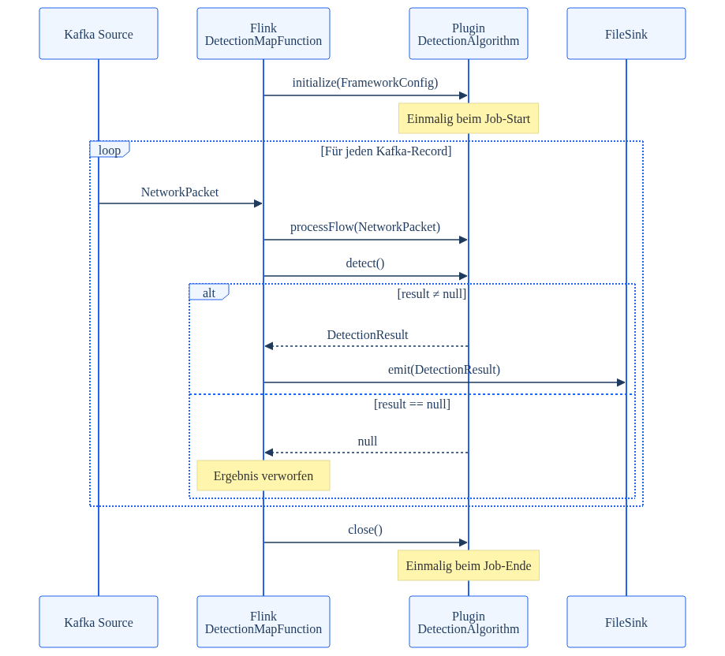
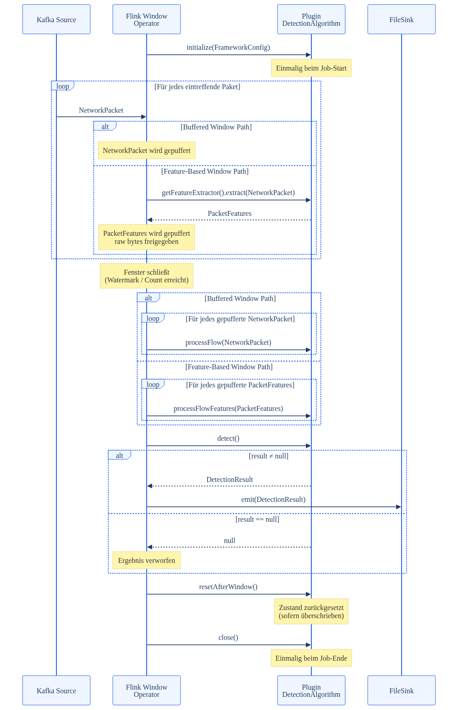

# Plugin Development Guide
## CEPHA – Covert Channel Examination and Packet-based Hidden Channel Analysis

--

## Table of Contents

1. [Introduction](#1-introduction)
   - 1.1 Purpose of this Document
   - 1.2 Target Audience and Prerequisites
   - 1.3 Relation to Other Documents
2. [Conceptual Overview](#2-conceptual-overview)
   - 2.1 Role of a Plugin within CEPHA
   - 2.2 Plugin Lifecycle and Execution Paths
3. [Project Setup](#3-project-setup)
   - 3.1 Maven Dependency and Project Structure
   - 3.2 Building a Deployable JAR
4. [The Plugin Contract](#4-the-plugin-contract)
   - 4.1 The DetectionAlgorithm Interface
   - 4.2 NetworkPacket Plugin Input
   - 4.3 PacketFeatures Reduced Input for Feature-based Windows
   - 4.4 DetectionResult Plugin Output
   - 4.5 FrameworkConfig and config.json
5. [Windowing and Execution Modes](#5-windowing-and-execution-modes)
   - 5.1 Choosing a Processing Path
   - 5.2 Window Types
   - 5.3 Window Lifecycle and State Reset
   - 5.4 Execution Modes
6. [Implementation Walkthrough](#6-implementation-walkthrough)
   - 6.1 A Buffered Window Example
   - 6.2 Custom Flow Partitioning
   - 6.3 Extending to the Feature-Based Window Path
7. [Deployment](#7-deployment)
   - 7.1 Uploading a Plugin / Upload Tab
   - 7.2 Managing and Executing Algorithms / Verwaltung Tab
   - 7.3 Kafka Setup / Kafka Tab
   - 7.4 Inspecting Results
8. [Troubleshooting](#8-troubleshooting)
   - 8.1 Common Errors and Diagnostics

---

## 1 Introduction

### 1.1 Purpose of this Document

This guide describes how to develop detection plugins for the CEPHA framework. CEPHA (Covert Channel Examination and Packet-based Hidden channel Analysis) is a distributed stream-processing framework built on Apache Flink 1.20 that analyses network traffic for signs of covert communication channels.

A plugin is a self-contained unit of detection logic. This document explains how to implement, build, and deploy a plugin. It does not cover the installation or operation of the CEPHA framework itself, nor the configuration of the underlying Flink cluster or Kafka infrastructure. Those topics are addressed in the CEPHA Technical Reference.

### 1.2 Target Audience and Prerequisites

This guide is written for developers who intend to implement detection algorithms as CEPHA plugins. The target audience is researchers and engineers with a background in computer science, 


The following knowledge is assumed:

- Proficiency in Java (SE 17 or later)
- Familiarity with Apache Maven as a build tool
- Basic understanding of network protocols (IP, TCP/UDP) and the pcap packet format
- General knowledge of stream processing concepts (events, windows, state)

Knowledge of Apache Flink internals is **not** required. The plugin interface is deliberately designed to be independent of Flink-specific APIs; the framework handles all pipeline construction and operator lifecycle management transparently.

### 1.3 Relation to Other Documents

This guide is one of several documents covering the CEPHA ecosystem:

| Document                                           | Scope                                                               |
| -------------------------------------------------- | ------------------------------------------------------------------- |
| **CEPHA Plugin Development Guide** (this document) | Implementing, building, and deploying detection plugins             |
| CEPHA Technical Reference                          | Framework architecture, configuration, and operational procedures   |
| CEPHA Deployment Guide                             | How to Deploy CEPHA standalone or in a cluster                      |
| Apache Flink 1.20 Documentation                    | Underlying execution engine; relevant for advanced state management |
| OpenObserve Documentation                          | Result storage and query layer for DetectionResult output           |


---

## 2 Conceptual Overview

### 2.1 Role of a Plugin within CEPHA

A CEPHA plugin is a self-contained unit of detection logic. Its sole responsibility is to analyse network packets and produce a detection result. All surrounding infrastructure, reading packets from Kafka, partitioning traffic into flows, managing windows, distributing work across TaskManagers, and writing results to the filesystem, is provided by the framework and requires no involvement from the plugin author.

A plugin is packaged as a standard JAR file and uploaded to a running CEPHA instance through the REST API. The framework loads the plugin at job submission time without restarting or rebuilding any framework component. The only compile-time dependency a plugin requires is the `detection-api` module, which defines the interface and all data types exchanged between the framework and the plugin. The fully qualified class name of the plugin's entry point is not read from the JAR itself; it is supplied separately via the `algorithmClassName` key in `config.json` (Section 4.5), which the framework uses to load the class from the uploaded JAR via a `URLClassLoader`.

A plugin receives packets, accumulates whatever internal state its algorithm requires, and returns a result when asked.
### 2.2 Plugin Lifecycle and Execution Paths

The framework controls the lifecycle of every plugin instance through three methods, called in a fixed sequence. In addition, the framework selects one of three execution paths at job construction time, based on the `windowType` configuration parameter and the return value of `supportsFeatureExtraction()`. The execution path determines which data-processing methods are called and when.

##### The execution paths

| Path                 | Condition                                               | Data method                     | When called                                                  |
| -------------------- | ------------------------------------------------------- | ------------------------------- | ------------------------------------------------------------ |
| Per-Packet           | `windowType: none`                                      | `processFlow(packet)`           | Once per arriving packet,`detect()` immediately there after. |
| Buffered Window      | windowed, `supportsFeatureExtraction()` returns `false` | `processFlow(packet)`           | At window close for every buffered `NetworkPaket`            |
| Feature-Based Window | windowed, `supportsFeatureExtraction()` returns `true`  | `processFlowFeatures(features)` | At window close for every buffered `PacketFeatures`          |

The choice between paths Buffered Window and Feature-Based Window is the primary design decision when writing a windowed plugin The Buffered Window Path is simpler and operates on the full `NetworkPacket` object. The Feature-Based Window Path requires implementing a `PacketFeatureExtractor` that reduces each packet to a lightweight `PacketFeatures` object immediately on arrival at the `keyby()`stage. The raw packet bytes are then eligible for garbage collection, reducing memory pressure over large windows. Both paths are discussed in detail in Chapter 5.

The framework does not enforce the implementation of a data-processing method at compile time. A class that implements only `initialize()`, `detect()`, and `close()` will compile and deploy without error, but `detect()` will be called with no data having been processed.

Depending on the chosen execution path, exactly one of the following methods must be overridden

For Feature-Based Windows, `supportsFeatureExtraction()` must additionally return `true` and `getFeatureExtractor()` should be overridden to extract the specific fields the algorithm requires.

| Path                 | Method to override                             |
| -------------------- | ---------------------------------------------- |
| Per-Packet           | `processFlow(NetworkPacket packet)`            |
| Buffered Window      | `processFlow(NetworkPacket packet)`            |
| Feature-Based Window | `processFlowFeatures(PacketFeatures features)` |

Per-Packet:



Buffered Window/ Feature-Based Window (alt - Box):



## 3 Project Setup

### 3.1 Adding the Dependency via JitPack

Prerequisites:

| Requirement | Minimum Version |
|---|---|
| Java JDK | 17 |
| Apache Maven | 3.8 |
| Git | any |

A plugin does not require cloning `CEPHA_`. The `detection-api` artifact is resolved directly from GitHub via [JitPack](https://jitpack.io), so a plugin project only needs a repository entry and a dependency entry in its own `pom.xml`:

```xml
<repositories>
    <repository>
        <id>jitpack.io</id>
        <url>https://jitpack.io</url>
    </repository>
</repositories>

<dependencies>
    <dependency>
        <groupId>com.github.Xetgatgram.CEPHA</groupId>
        <artifactId>detection-api</artifactId>
        <version>v1.0.0</version>
        <scope>provided</scope>
    </dependency>
</dependencies>
```

Replace `<VERSION>` with a git tag, branch name (for example `Refactor-SNAPSHOT`), or commit hash of the `Xetgatgram/CEPHA` repository. JitPack builds that reference on first request and caches the result, so the first resolution can take a minute or two while subsequent builds are served from cache.

The `scope=provided` setting is deliberate. The framework supplies `detection-api` on the classpath at runtime, so it must not be packaged into the plugin JAR. Section 3.4 covers why this removes the need for a shading step.

### 3.2 Project Structure

A plugin is a standalone Maven module with no parent POM and no dependency on the rest of `CEPHA_REPO`'s multi-module structure. A minimal project looks like this:

```text
my-covert-channel-detector/
├── pom.xml
└── src/
    └── main/
        ├── java/
        │   └── com/example/detector/
        │       └── MyDetector.java
        └── resources/
```

Start a new plugin by adapting the template `pom.xml` in Section 3.4, implementing the `DetectionAlgorithm` interface (Chapter 4), and setting `algorithmClassName` to the new fully-qualified class name in the plugin's `config.json` (Section 4.5) rather than in any build artifact. The full implementation walkthrough is in Chapter 6. For a working end-to-end reference, the `cabuk-detector` module in `CEPHA_REPO` shows a complete implementation built the same way.

### 3.3 Alternative: Sparse Checkout of detection-api

If JitPack is not useable in your environment, a sparse checkout retrieves only the `detection-api` sources without cloning the rest of `CEPHA_REPO`:

```bash
git clone --filter=blob:none --sparse https://github.com/Xetgatgram/CEPHA.git
cd CEPHA
git sparse-checkout set detection-api
mvn install -pl detection-api -DskipTests
```

This installs `detection-api` into the local Maven repository under the coordinates declared in its own `pom.xml`,
so a plugin can depend on it as `com.covertchannel:detection-api:1.0.0` instead of the JitPack coordinates. 
Since this path builds and consumes the artifact locally, the `scope=provided` guidance from Section 3.1 still applies. 
Only the dependency's `groupId` and repository declaration differ between the two paths, everything else in this chapter is unaffected by which one you choose.

### 3.4 Building a Deployable JAR

Because `detection-api` and its transitive dependencies are declared with `scope=provided`, they are not needed inside the plugin JAR.
The framework provides them on the classpath at runtime. A plain `maven-jar-plugin` build is therefore enough.

```xml
<?xml version="1.0" encoding="UTF-8"?>
<project xmlns="http://maven.apache.org/POM/4.0.0"
         xmlns:xsi="http://www.w3.org/2001/XMLSchema-instance"
         xsi:schemaLocation="http://maven.apache.org/POM/4.0.0
         http://maven.apache.org/xsd/maven-4.0.0.xsd">
    <modelVersion>4.0.0</modelVersion>

    <groupId>com.example</groupId>
    <artifactId>my-covert-channel-detector</artifactId>
    <version>1.0.0</version>
    <packaging>jar</packaging>

    <name>My Covert Channel Detector</name>
    <description>Independent CEPHA detection plugin</description>

    <properties>
        <maven.compiler.source>17</maven.compiler.source>
        <maven.compiler.target>17</maven.compiler.target>
        <project.build.sourceEncoding>UTF-8</project.build.sourceEncoding>
    </properties>

    <repositories>
        <repository>
            <id>jitpack.io</id>
            <url>https://jitpack.io</url>
        </repository>
    </repositories>

    <dependencies>
        <dependency>
            <groupId>com.github.Xetgatgram.CEPHA</groupId>
            <artifactId>detection-api</artifactId>
            <version>v1.0.0</version>
            <scope>provided</scope>
        </dependency>

        <dependency>
            <groupId>org.pcap4j</groupId>
            <artifactId>pcap4j-core</artifactId>
            <version>1.8.2</version>
            <scope>provided</scope>
        </dependency>
        <dependency>
            <groupId>org.pcap4j</groupId>
            <artifactId>pcap4j-packetfactory-static</artifactId>
            <version>1.8.2</version>
            <scope>provided</scope>
        </dependency>

        <dependency>
            <groupId>org.slf4j</groupId>
            <artifactId>slf4j-api</artifactId>
            <version>2.0.7</version>
        </dependency>
    </dependencies>

    <build>
        <plugins>
            <plugin>
                <groupId>org.apache.maven.plugins</groupId>
                <artifactId>maven-jar-plugin</artifactId>
                <version>3.4.1</version>
            </plugin>
        </plugins>
    </build>
</project>
```

```bash
mvn package
# produces: target/my-covert-channel-detector-1.0.0.jar
```

As with the previous approach, the JAR manifest does not need to declare the entry-point class. 
The framework reads the fully-qualified class name from the `algorithmClassName` key in the accompanying `config.json`, uploaded separately alongside the JAR (Section 7.1).

---

## 4 The Plugin Contract

### 4.1 The DetectionAlgorithm Interface

Every CEPHA plugin is a Java class that implements the `DetectionAlgorithm` interface, located in the `detection-api` module at `com.covertchannel.framework.api.DetectionAlgorithm`. The interface extends `java.io.Serializable`, this is a Flink requirement, since operator state including the algorithm instance itself must be serialisable across the cluster. The `serialVersionUID` is fixed at `1L` and should not be overridden by plugin authors unless custom serialisation logic is explicitly required.

The interface defines two categories of methods: required and extension. Required methods must be implemented by every plugin. Extension methods carry default implementations and are overridden selectively depending on the chosen execution path.

Because `DetectionAlgorithm` extends `Serializable`, every field declared in a plugin class must itself be serialisable, or must be declared `transient`. Fields that cannot be serialised, must be declared `transient` and re-initialised inside `initialize()` or lazily on first use. A `NotSerializableException` at job submission is almost always caused by a non-transient, non-serialisable field.


##### Required Methods
| Method                                      | Called when                          | Returns                     |
| ------------------------------------------- | ------------------------------------ | --------------------------- |
| `void initialize(FrameworkConfig config)`   | Once at job start                    | -                           |
| `DetectionResult detect() throws Exception` | At window close or after each packet | `DetectionResult` or `null` |
| `void close()`                              | Once at job end                      | -                           |
`void initialize(FrameworkConfig config)`  
Called exactly once when the Flink job starts, before any packet arrives. This is the correct place to read algorithm-specific configuration parameters from `FrameworkConfig` and to initialise all internal state. The `FrameworkConfig` object is constructed from the plugin-specific keys in `config.json` and is described in Section 4.4.

`DetectionResult detect() throws Exception`  
Called by the framework to request a result. In windowed paths, this occurs once after all packets or features for the window have been processed. In the per-packet path, it is called immediately after each `processFlow()` invocation. The method may return a fully populated `DetectionResult`, or `null` to suppress output for the current window or packet. Returning `null` is valid and expected behaviour. Any exception thrown here is treated as a fatal operator error.

`void close()`  
Called exactly once when the job terminates, either through a planned shutdown or a cancellation. This is the correct place to release resources and finalise any remaining internal state. No result is emitted from `close()`.

##### Extension Methods
| Method                                              | Default                                | Override when                                                       |
| --------------------------------------------------- | -------------------------------------- | ------------------------------------------------------------------- |
| `void processFlow(NetworkPacket packet)`            | no-op                                  | For per- Packet or Buffered window Path                             |
| `void processFlowFeatures(PacketFeatures features)` | throws `UnsupportedOperationException` | For Feature-based Window Path                                       |
| `void resetAfterWindow()`                           | no-op                                  | Per-window state must be cleared                                    |
| `boolean supportsFeatureExtraction()`               | `return false`                         | For Feature-based Window Path                                       |
| `PacketFeatureExtractor getFeatureExtractor()`      | timestamp-only extractor               | For Feature-based Window Path, to extract algorithm-specific fields |
| `PacketKeyExtractor getKeyExtractor()`              | `srcIP->dstIP` extractor               | If Custom flow partitioning is required                             |
Although the framework does not enforce the implementation of a data-processing method at the interface level, every functional plugin must override exactly one of `processFlow()` or `processFlowFeatures()`. Which method applies depends on the chosen execution path as described in Section 2.2. A plugin that overrides neither will compile and deploy without error but will get no data from the Framework. This constraint is intentional by design. The interface imposes no path-specific compile-time obligation so that a single class may be deployed under different configuration, but the runtime consequence of omitting both methods is a silently non-functional plugin.

`void processFlow(NetworkPacket packet)`  
Called once per incoming `NetworkPacket`. On per-Packet path, this occurs for each arriving packet on the stream and `detect()` is called immediately after. On the Buffered Window path, the framework buffers all packets for the window and replays them in bulk at window close before calling `detect()`. The method must not throw checked exceptions, unhandled runtime exceptions route the packet to the dead-letter side output. The default implementation is a no-op.

`void processFlowFeatures(PacketFeatures features)`  
Called once per buffered `PacketFeatures` object at window close, on Feature-based Window path only. The default implementation throws `UnsupportedOperationException`, this method must be overridden whenever `supportsFeatureExtraction()` returns `true`. `PacketFeatures` is described in Section 4.3.

`void resetAfterWindow()`  
Called by the framework after each window result is emitted, on windowed paths only. The default implementation is a no-op, which means state accumulates across windows. Override this method with state-clearing logic for algorithms that should be window-isolated, so that these algorithms, whose detection logic is scoped to a single window, reset their state.

`boolean supportsFeatureExtraction()`  
Controls which of the two windowed processing paths the framework uses. If `false` (the default), Buffered Window path is active. IF `true`, Feature-based Window path is active and `processFlowFeatures()` is called instead of `processFlow()` at window close. This method must return `true` in conjunction with overriding `processFlowFeatures()` and `getFeatureExtractor()`.

`PacketFeatureExtractor getFeatureExtractor()`  
Returns the extractor the framework uses to reduce each incoming `NetworkPacket` to a `PacketFeatures` object before buffering. Only relevant on the Feature-based Window path. The default implementation retains only the capture timestamp. Override this method to extract the specific fields the algorithm needs, so that the full raw packet payload can be garbage-collected immediately after extraction. The `PacketFeatureExtractor` interface is a `@FunctionalInterface` and can be implemented as a lambda.

`PacketKeyExtractor getKeyExtractor()`  
Returns the extractor the framework uses to partition the incoming packet stream into logical flows via `keyBy()`. The default implementation derives a `srcIP->dstIP` string key. If no IP layer is present, it returns `"Unknown"`. If the packet is `null` or parsing fails, it returns `"null"`. Override this method when the algorithm requires a different partitioning boundary. 
The default `srcIP->dstIP` key preserves the ordering guarantee established by the Kafka producer, which routes all packets originating from the same source IP address to the same Kafka partition. Any key extractor that incorporates the source IP address inherits this guarantee because all packets for a given flow originate from a single partition and arrive in order. Key extractors that do not incorporate the source IP address, for example extractors keying solely by destination IP or by destination port, may aggregate packets from multiple Kafka partitions into a single logical flow. In that case strict packet arrival order cannot be assumed and the algorithm must be designed to tolerate out-of-order input. The `PacketKeyExtractor` interface is a `@FunctionalInterface` and can be implemented as a lambda. Flow partitioning and its effect on detection quality are discussed in Section 4.5.

### 4.2 NetworkPacket  Plugin Input

`NetworkPacket` is the object passed to `processFlow()` on every invocation. It represents a single network packet as captured from a live network interface or a PCAP file, and is the plugin's source of input data. The class is defined at `com.covertchannel.processor.NetworkPacket` and implements `Serializable`.

`NetworkPacket` transmits three serialised fields, the raw packet bytes, the Data Link Type identifier, and the capture timestamp. Protocol parsing is deferred until the plugin explicitly calls `getRawPacket()`, at which point pcap4j reconstructs the full packet tree using the DLT to determine the correct link-layer decoder. The parsed object is then cached in a `transient` field for the lifetime of the JVM instance, so repeated calls to `getRawPacket()` within the same `processFlow()` invocation carry no additional parsing cost.

##### Available Fields

| Method                  | Return type                | Description                                                          |
| ----------------------- | -------------------------- | -------------------------------------------------------------------- |
| `getCaptureTimestamp()` | `long`                     | Capture time in milliseconds since Unix epoch                        |
| `getRawPacketData()`    | `byte[]`                   | Raw packet bytes as captured                                         |
| `getDltId()`            | `int`                      | Data Link Type ID (e.g. `1` = Ethernet, `113` = Linux SLL)           |
| `getRawPacket()`        | `org.pcap4j.packet.Packet` | Lazily parsed pcap4j packet tree. Can return `null`                  |
| `getCustomKey()`        | `String`                   | Partitioning key assigned by `PacketKeyExtractor`, `null` if not set |


For most detection algorithms, `getCaptureTimestamp()` and `getRawPacket()` are the only two methods needed.

The value returned by `getCaptureTimestamp()` is the original capture time as recorded at capturing, not the time of Kafka transmission or Flink processing. This makes it suitable for time-based analysis such as inter-arrival time computation. The ingestion pipeline and timestamp origin are described in the CEPHA Technical Reference.

`getRawPacket()` returns the root of the pcap4j packet tree. Protocol headers at any layer are accessed via the generic `get(Class<T>)` method on the returned `Packet` object. If the requested protocol layer is not present,`null` is returned. 

##### Example
``` java
Packet packet = netPacket.getRawPacket();
if (packet == null) {
    return; // parsing failed -- skip this packet
}
IpV4Packet ip4 = packet.get(IpV4Packet.class);
if (ip4 != null) {
    String src = ip4.getHeader().getSrcAddr().getHostAddress();
    String dst = ip4.getHeader().getDstAddr().getHostAddress();
}
```

### 4.3 PacketFeatures Reduced Input for Feature-based Windows 

`PacketFeatures` is the object passed to `processFlowFeatures()`. It is a lightweight, serializable data carrier produced by the `PacketFeatureExtractor` from a `NetworkPacket`.  It is defined at `com.covertchannel.processor.PacketFeatures`.

The purpose of `PacketFeatures` is to allow the plugin to discard the raw packet payload immediately after extraction, so that the framework buffers only the fields the algorithm actually needs across the window accumulation period. This reduces memory pressure compared to retaining all`NetworkPacket` objects until window close.

A `PacketFeatures` object is constructed with a mandatory capture timestamp and extended with algorithm-specific fields via a fluent `add()` API:

##### Example
```java
@Override 
public PacketFeatureExtractor getFeatureExtractor() {     
  return packet -> {
    PacketFeatures features = new PacketFeatures(packet.getCaptureTimestamp());        org.pcap4j.packet.Packet raw = packet.getRawPacket();        
	if (raw != null) {            
		IpV4Packet ip4 = raw.get(IpV4Packet.class);            
		if (ip4 != null) {                
			features.add("ttl", (int) ip4.getHeader().getTtl());           
		}        
	}        
	return features;    
  };
}
```
All values stored with `add()` must implement `java.io.Serializable`. This is enforced at compile time by the method signature `add(String key, Serializable value)`.

The following accessors are available on a `PacketFeatures` object inside `processFlowFeatures()`.

| Method                                  | Return type    | Description                                                |
| --------------------------------------- | -------------- | ---------------------------------------------------------- |
| `getCaptureTimestamp()`                 | `long`         | Capture time in milliseconds since Unix epoch              |
| `getCustomKey()`                        | `String`       | Flow partitioning key; set by the framework, do not modify |
| `get(String key)`                       | `Serializable` | Raw value access                                           |
| `getLong(String key, long default)`     | `long`         | Typed access with default                                  |
| `getInt(String key, int default)`       | `int`          | Typed access with default                                  |
| `getDouble(String key, double default)` | `double`       | Typed access with default                                  |
| `getString(String key, String default)` | `String`       | Typed access with default                                  |

`getCustomKey()` on a `PacketFeatures` object returns the same flow partitioning key as `getCustomKey()` on the originating `NetworkPacket`. It is set by the framework and must not be modified by the plugin.


### 4.4 DetectionResult  Plugin Output

`DetectionResult` is the object a plugin returns from `detect()`, at the end of each window. The class is defined at `com.covertchannel.processor.DetectionResult`and carries framework fields populated by the framework as well as those added by the plugin with `addDetail()`.

`addDetail(String key, Object value)` places an arbitrary key-value pair into the `analysisDetails` map. All values are written to the JSONL output file and are available for downstream analysis.

The following fields and `analysisDetails` entries are written by the framework. 

|Field|Per-Packet|Buffered Window|Feature-Based Window|
|---|---|---|---|
|`flowId`|set to `packet.getCustomKey()`|set to window key|set to window key|
|`packets_in_window`|not set|set|set|
|`aggregation_mode`|not set|`"buffered"`|`"incremental"`|
|`processing_timestamp`|not set|set|set|
|`flink_window_start`|not set|set (time windows only)|set (time windows only)|
|`flink_window_end`|not set|set (time windows only)|set (time windows only)|
Plugin authors should avoid using these keys in `addDetail()` to prevent silent overwrites.

If `detect()` returns `null`, the framework discards the result without writing to the output sink or the dead-letter queue.


### 4.5 FrameworkConfig and config.json

Every plugin is deployed with a `config.json` file that the REST API passes to the framework at job submission time. The framework constructs a `FrameworkConfig` object from this file and passes it to `initialize()`. All keys in `config.json` are available to the plugin.
`FrameworkConfig` provides typed accessors with explicit defaults.

| Method                                    |
| ----------------------------------------- |
| `getString(String key, String default)`   |
| `getInt(String key, int default)`         |
| `getDouble(String key, double default)`   |
| `getBoolean(String key, boolean default)` |
| `get(String key)`                         |
All values are stored internally as `Object` and converted via `toString()` before parsing. Plugin authors should not rely on the runtime type of values returned by `get()`.

##### Framework-Reserved Keys

The following keys are read by the framework and must not be redefined with conflicting semantics by plugin authors. They are also injected back into the `FrameworkConfig` passed to `initialize()`, so a plugin can read them to adapt its behaviour.

`algorithmClassName` (String, required)  
Fully qualified class name of the plugin entry point. The framework uses this to load the plugin from the JAR via `URLClassLoader`.

`executionMode` (String, default: `STREAMING`)  
Controls the Flink runtime mode and Kafka source behaviour.

|Value|Kafka source|Flink mode|Terminates|
|---|---|---|---|
|`STREAMING`|Unbounded, starts at earliest, never closes|STREAMING|No|
|`BATCH`|Bounded earliest to latest at submission time|BATCH|Yes|
|`REPLAY`|Bounded earliest to latest, streaming semantics|STREAMING|Yes|

`windowType` (String, default: `tumbling`)  
Selects the windowing strategy. The value `none` activates the Per-Packet path; all other values activate a windowed path.

|Value|Window type|
|---|---|
|`none`|Per-Packet -- no window|
|`tumbling`|Tumbling time window|
|`sliding`|Sliding time window|
|`session`|Session time window|
|`tumbling_count`|Tumbling count window|
|`sliding_count`|Sliding count window|


`windowSizeMs` (long, required for time-based windows)  
Window size in milliseconds. Required when `windowType` is `tumbling`, `sliding`, or `session` for `session` it is used to classify a pause as a gap an closes the Window.

`slideMs` (long, required for `sliding`)  
Slide interval in milliseconds. Required when `windowType` is `sliding`.

`windowCount` (long, required for count-based windows)  
Window size in number of packets. Required when `windowType` is `tumbling_count` or `sliding_count`.

`slideCount` (long, required for count-based windows)  
Slide step in number of packets. Set to `0` or equal to `windowCount` for tumbling behaviour. Must not exceed `windowCount`.

`parallelism` (int, optional)  
Flink operator parallelism. If absent, the cluster default applies.

`partialFlush` (boolean, default: `false`)  
Relevant only in `BATCH` mode with count-based windows. When `true`, a window that has not reached its target packet count at stream end is flushed and processed rather than discarded. Has no effect in `STREAMING` or `REPLAY` mode, or with time-based windows.

The annotated template below uses `//` comments for documentation purposes. The `config.json` file is parsed by a strict JSON parser (Jackson `ObjectMapper`) and must not contain comments Use the clean template at the end of this section as a starting point.

```json

{
  // ── Required ──────────────────────────────────────────────────
  "algorithmClassName": "com.example.MyDetector",   // Fully qualified class name
  "inputTopic":     "network-packets", 
  // Kafka input topic, the topic that is read from

  // ── Execution Mode ────────────────────────────────────────────
  // STREAMING (default) | BATCH | REPLAY
  "executionMode":  "STREAMING",

  // ── Window Type ───────────────────────────────────────────────
  // none | tumbling | sliding | session | tumbling_count | sliding_count
  "windowType":     "tumbling",

  // ── Time-Based Windows (tumbling / sliding / session) ─────────
  "windowSizeMs":   60000,    // Window size in milliseconds (required)
  "slideMs":        30000,    // Slide interval in ms (sliding only)

  // ── Count-Based Windows (tumbling_count / sliding_count) ──────
  "windowCount":    128,      // Window size in packets (required)
  "slideCount":     0,        // Slide step; 0 = tumbling behaviour

  // ── Optional ──────────────────────────────────────────────────
  "parallelism":    2,        // Flink operator parallelism (default: cluster default)
  "partialFlush":   false,    // Flush incomplete count windows at stream end (BATCH only)

  // ── Algorithm-Specific Keys ───────────────────────────────────
  "myThreshold":    0.75,
  "myWindowParam":  512
}

```
##### Example template
```json

{
  "algorithmClassName": "com.example.MyDetector",
  "inputTopic":     "network-packets",
  "executionMode":  "STREAMING",
  "windowType":     "tumbling",
  "windowSizeMs":   10000
}
```

## 5 Windowing and Execution Modes

This chapter addresses the decisions the plugin author must make before writing algorithm code.

### 5.1 Choosing a Processing Path

Three processing paths are available. The framework selects the path at job submission time based on two signals, the `windowType` key in `config.json` and the return value of `supportsFeatureExtraction()`.

|Path|`windowType`|`supportsFeatureExtraction()`|
|---|---|---|
|Per-Packet|`none`|not evaluated|
|Buffered Window|any except `none`|`false`|
|Feature-Based Window|any except `none`|`true`|

**Per-Packet** gives the algorithm complete control over its own state and output timing. The framework calls `processFlow()` and `detect()` for every arriving packet without imposing any boundary. The algorithm accumulates state freely and decides entirely on its own when to emit a result,`detect()` may return `null` indefinitely. This path is appropriate for algorithms that monitor long-running patterns, wait for specific packet sequences, or apply custom stateful logic that does not map naturally onto a fixed window size. `supportsFeatureExtraction()` is not evaluated on this path; the Feature-Based pipeline is never instantiated.

**Buffered Window** is the recommended default for window-based algorithms. The framework retains all `NetworkPacket` objects for the current window in memory. When the window fires, `processFlow()` is called for each packet in arrival order, followed by `detect()`. Memory consumption scales with the number of packets in the window.

**Feature-Based Window** reduces memory consumption by discarding the raw packet payload as early as possible in the pipeline. Before `keyBy()`, a dedicated map operator calls `getKeyExtractor().getKey(packet)` and `getFeatureExtractor().extract(packet)` on each arriving `NetworkPacket` in a single pass, assigns the resulting `customKey` to the `PacketFeatures` object, and releases the packet cache immediately. Only the lightweight `PacketFeatures` objects are retained and partitioned. When the window fires, `processFlowFeatures()` is called for each feature set before `detect()` is invoked. This path requires implementing `getFeatureExtractor()`, `processFlowFeatures()`, and returning `true` from `supportsFeatureExtraction()`.

### 5.2 Window Types

The following window types are available for both the Buffered Window and Feature-Based Window paths.

| `windowType`     | Required keys               | Behaviour                                                                                    |
| ---------------- | --------------------------- | -------------------------------------------------------------------------------------------- |
| `tumbling`       | `windowSizeMs`              | Non-overlapping fixed-duration windows, each packet belongs to exactly one window            |
| `sliding`        | `windowSizeMs`, `slideMs`   | Overlapping windows, a packet may appear in multiple windows when `slideMs` < `windowSizeMs` |
| `session`        | `windowSizeMs`              | Windows close after a gap of inactivity exceeding `windowSizeMs`                             |
| `tumbling_count` | `windowCount`, `slideCount` | Fixed packet-count windows, set `slideCount` to `0` for tumbling behaviour                   |
| `sliding_count`  | `windowCount`, `slideCount` | Overlapping packet-count windows, `slideCount` must be less than `windowCount`               |

Time-based windows use event time. The event time assigned to each packet is the value of `captureTimestamp`, which reflects the original recording time from the PCAP capture file. Window boundaries are therefore determined by the actual capture timeline of the traffic. Out-of-order packets are tolerated up to a 10 ms bound.

Count-based windows are independent of time. In `BATCH` mode, the final window at stream end may contain fewer packets than `windowCount`. Setting `partialFlush: true` causes this incomplete window to fire rather than be discarded. see Section 4.5.


### 5.3 Window Lifecycle and State Reset

Each window invocation follows the same sequence regardless of window type or path:


![[windowflow 1.png|393]]


`resetAfterWindow()` is a default no-op called by the framework after every `detect()` invocation. Override it to clear per-window state and restore the same initial values set in `initialize()`. If no override is provided, state persists across window boundaries. 

---

>***Note:** A flow is always assigned to exactly one task slot, but a task slot handles multiple flows (a 1:n relationship), and the same plugin instance is reused for all of them. The framework does not enforce any particular state scoping, it is entirely up to the plugin author to decide how state should behave across flows and windows. If resetAfterWindow() is not overridden, or state is otherwise not reset, that state persists into the next window and the next flow handled by the same slot, whichever that may be. If state is meant to stay separated per window, resetAfterWindow() is the intended place to reset it. Whether this separation is actually desired, for example because flows are meant to stay separated, or because combining state across flows is intended, is a design decision the plugin author has to make and account for; the framework will not make it for you.*

---

The plugin instance is not re-created between windows. `initialize()` is called exactly once at job start, the framework reuses the same object for the lifetime of the operator.
### 5.4 Execution Modes

The `executionMode` key controls how the framework connects to Kafka and whether the job terminates. The window configuration and plugin code are identical across all modes.

| Mode        | Source behaviour                                              | Terminates | Primary use case                                                                  |
| ----------- | ------------------------------------------------------------- | ---------- | --------------------------------------------------------------------------------- |
| `STREAMING` | Unbounded. Starts at the earliest available offset like `BATCH`/`REPLAY`, but never closes and keeps consuming newly arriving messages | No         | Live traffic monitoring.                                                          |
| `BATCH`     | Bounded. Reads earliest to latest offset at submission time   | Yes        | Offline analysis of recorded traffic.                                             |
| `REPLAY`    | Same bounded source as `BATCH`, streaming execution semantics | Yes        | Reproducible re-analysis with output structure consistent with a `STREAMING` run. |

In `STREAMING` and `REPLAY` mode, state at any point is bounded by the current window's content. In `BATCH` mode, the entire dataset is processed as a unit and intermediate results between pipeline stages could be materialised to disk, which can result in higher total disk I/O for large inputs. The underlying execution model is described in detail in the CEPHA Technical Reference.

---

## 6 Implementation Walkthrough

This chapter presents a complete plugin implementation. Section 6.1 shows a plugin using the Buffered Window path. Section 6.2 extends the same plugin to the Feature-Based Window path by adding three methods.

### 6.1 A Buffered Window Example

The following plugin serves as an illustrative example. It computes the coefficient of variation (CV) of inter-arrival times within a tumbling time window and emits a result when the CV exceeds a configurable threshold.

```java

package com.example.detection;

import com.covertchannel.framework.api.DetectionAlgorithm;
import com.covertchannel.framework.api.FrameworkConfig;
import com.covertchannel.processor.DetectionResult;
import com.covertchannel.processor.NetworkPacket;

import java.util.ArrayList;
import java.util.List;

public class InterArrivalCvDetector implements DetectionAlgorithm {

    private static final long serialVersionUID = 1L;

    // Configuration 
    private double threshold;
    private int minPackets;

    // Per-window state
    private List<Long> timestamps;

    // Lifecycle 

    @Override
    public void initialize(FrameworkConfig config) {
        this.threshold  = config.getDouble("threshold",  0.5);
        this.minPackets = config.getInt("minPackets", 10);
        this.timestamps = new ArrayList<>();
    }

    @Override
    public void processFlow(NetworkPacket packet) {
        timestamps.add(packet.getCaptureTimestamp());
    }

    @Override
    public DetectionResult detect() throws Exception {
        if (timestamps.size() < minPackets) {
            return null;
        }

        double cv = computeCv(timestamps);

        DetectionResult result = new DetectionResult();
        result.addDetail("cv",cv);
        result.addDetail("packetCount",timestamps.size());
        result.addDetail("detected",cv > threshold);
        return result;
    }

    @Override
    public void close() {
        timestamps = null;
    }

    @Override
    public void resetAfterWindow() {
        timestamps = new ArrayList<>();
    }

    //  Algorithm 

    private double computeCv(List<Long> ts) {
        if (ts.size() < 2) return 0.0;

        List<Long> deltas = new ArrayList<>();
        for (int i = 1; i < ts.size(); i++) {
            deltas.add(ts.get(i) - ts.get(i - 1));
        }

        double mean = deltas.stream().mapToLong(Long::longValue).average().orElse(0);
        if (mean == 0) return 0.0;

        double variance = deltas.stream()
                .mapToDouble(d -> Math.pow(d - mean, 2))
                .average().orElse(0);

        return Math.sqrt(variance) / mean;
    }
}

```
The config.json

```json
{
  "algorithmClassName": "com.example.detection.InterArrivalCvDetector",
  "inputTopic":     "network-packets",
  "executionMode":  "STREAMING",
  "windowType":     "tumbling",
  "windowSizeMs":   30000,
  "threshold":      0.5,
  "minPackets":     10
}
```
Some points explained:

- `resetAfterWindow()` reinitialises `timestamps` to a fresh list. Without this override the list would accumulate across windows.

- `detect()` returns `null` when fewer than `minPackets` packets were seen, this is the correct pattern for insufficient data.

- `close()` releases the list explicitly. This is optional for garbage-collected objects but recommended.

- The framework writes `flowId`, `window_start`, `window_end`, and `packets_in_window` into the result automatically, the plugin populates `analysisDetails`.


### 6.2 Custom Flow Partitioning 

The default key extractor partitions traffic by source and destination IP address (`srcIp->destIp`). This means all traffic between two hosts is processed by the same plugin instance, regardless of port or protocol. For algorithms that distinguish individual connections this granularity is too coarse.

Overriding `getKeyExtractor` replaces the default with any deterministic function of the packet. The most common override is the five-tuple: source IP, destination IP, source port, destination port, and protocol.

```java
@Override
public PacketKeyExtractor getKeyExtractor() {
    return packet -> {
        Packet raw = packet.getRawPacket();
        if (raw == null) return "unknown";

        IpV4Packet ip4 = raw.get(IpV4Packet.class);
        if (ip4 == null) return "unknown";

        String src = ip4.getHeader().getSrcAddr().getHostAddress();
        String dst = ip4.getHeader().getDstAddr().getHostAddress();
        String proto = ip4.getHeader().getProtocol().name();

        TcpPacket tcp = raw.get(TcpPacket.class);
        if (tcp != null) {
            return src + ":" + tcp.getHeader().getSrcPort().valueAsInt()
                 + "-" + dst + ":" + tcp.getHeader().getDstPort().valueAsInt()
                 + "-" + proto;
        }

        UdpPacket udp = raw.get(UdpPacket.class);
        if (udp != null) {
            return src + ":" + udp.getHeader().getSrcPort().valueAsInt()
                 + "-" + dst + ":" + udp.getHeader().getDstPort().valueAsInt()
                 + "-" + proto;
        }

        // Non-TCP/UDP: fall back to three-tuple
        return src + "-" + dst + "-" + proto;
    };
}
```

**Two Important Notes:**

A finer-grained key increases the number of parallel plugin instances and reduces the packet count per window. When using count-based windows (`windowType: tumblingcount`), verify that the expected flow volume for the custom Key is sufficient to reach `windowCount`.

When the Kafka source topic has more than one partition, the source IP address should always be included in the key, as the framework uses it to preserve packet ordering across partitions.

### 6.3 Extending to the Feature-Based Window Path

The Feature-Based Window path requires three additions to the plugin above. Everything else remains identical.

**Addition 1 : Signal to the framework:**
```java

@Override public boolean supportsFeatureExtraction() {     return true; }
```

**Addition 2 : Define what to extract per packet:**
```java
@Override public PacketFeatureExtractor getFeatureExtractor() {     
return packet -> new PacketFeatures(packet.getCaptureTimestamp()); }
```
The extractor runs before `keyBy()`, in the same operator pass that assigns the `customKey`. After `extract()` returns, the framework releases the raw `NetworkPacket`and only the `PacketFeatures` object is retained for the window.

**Addition 3 : process the extracted features instead of raw packets:**

```java
@Override public void processFlowFeatures(PacketFeatures features) {     timestamps.add(features.getCaptureTimestamp()); }
```
`processFlow()` is no longer called on this path. The framework calls `processFlowFeatures()` for each `PacketFeatures` object in the window, then calls `detect()` once.

For this particular algorithm the only data needed per packet is the capture timestamp. For algorithms that require additional fields, `PacketFeatures` provides a fluent `add()` API.

```java
return new PacketFeatures(packet.getCaptureTimestamp())     
.add("ttl",(Integer) ip4.getHeader().getTtl())    
.add("payloadLen", (Integer) ip4.getHeader().getTotalLength());
```
Values stored via `add()` are retrieved in `processFlowFeatures()` using the typed accessors `getInt()`, `getLong()`, `getDouble()`, and `getString()`, each accepting a default value.

---

## 7 Deployment

The framework exposes a web-based management interface at `http://<jobmanager>:8080`. This interface covers the complete lifecycle of a plugin from upload to result retrieval. All operations performed through the UI correspond to REST calls documented in the CEPHA Technical Reference; the UI is the recommended entry point for manual operation.

#### 7.1 Uploading a Plugin / _Upload_ Tab

The Upload tab contains two independent forms, which must both be completed before a plugin can be executed.

**JAR Upload**  
Enter the chosen `algorithmId` (e.g. `my-detector`) and select the compiled plugin JAR. The `algorithmId` is a free-form string and must be consistent across all subsequent operations for this plugin.

**Config Upload**  
Enter the same `algorithmId` and upload the `config.json` as described in Section 4.5. Both files are stored under `/opt/flink-plugins/{algorithmId}/` on the Job Manager.

#### 7.2 Managing and Executing Algorithms / _Verwaltung_ Tab

The Verwaltung tab lists all uploaded algorithms as cards. Each card shows:

- Whether the JAR and `config.json` are both present (badges `✓ JAR` / `✓ Config`, or `✗ fehlt` if incomplete)
    
- A readiness status (`✓ Bereit` / `⚠ Unvollständig`)

A plugin is ready to execute only when both files are present. Clicking **▶ Ausführen** submits the job to Flink. The resulting Flink `jobId` is displayed in a confirmation dialog and can be used to monitor the job in the Flink Dashboard.

From the same card, individual JAR files or the complete algorithm (JAR + config) can be deleted.

#### 7.3 Kafka Setup / _Kafka_ Tab

The Kafka tab provides three panels for configuring the input side of the pipeline.

Kafka Producer controls how network traffic is fed into the `network-flows` topic:

- _Live Capture_ Selects a network interface, an optional BPF filter (e.g. `tcp and port 443`), and starts a live packet capture
    
- _PCAP File Production_  Replays a stored `.pcap` file into a topic, with an optional packet limit
    

**Kafka Topics** lists all existing topics with message counts and partition details. New topics can be created directly from this panel.

**Consumer Groups** lists active consumer groups. Stale groups from cancelled BATCH or REPLAY jobs can be deleted here; the group must be in `EMPTY` state (i.e., the corresponding Flink job must have terminated first).

#### 7.4 Inspecting Results

Detection results are written as JSONL files to the path configured in `CEPHA_OUTPUT_PATH`. Each Task Manager writes its own result file(s). The rolling policy governing when files are finalised depends on the `executionMode` as described in Section 4.5.

Result files are ingested into OpenObserve via Fluent Bit, which monitors the output path and forwards new JSONL lines as they are written. Visualisation and download of results is performed directly in OpenObserve.

Each line in a result file is a JSON-serialised `DetectionResult`.

The management UI does not include a dedicated "Results" tab. Results are distributed across the TaskManagers that produced them and are only consolidated once ingested into OpenObserve, so a single-pane, framework-native results view is not currently feasible without that consolidation step. A `/results/tree` and `/results/download` REST endpoint pair exists in the codebase for this purpose but is not yet functional end-to-end; treat it as planned, not production-ready, and rely on OpenObserve or direct filesystem access for now.

Two external dashboards are linked directly from the bottom of the management UI `http://<jobmanager>:8080`.

| Dashboard           | Default URL                | Purpose                                                                    |
| ------------------- | -------------------------- | -------------------------------------------------------------------------- |
| **Flink Dashboard** | `http://<jobmanager>:8081` | Monitor running jobs, inspect task parallelism, view checkpointing status. |
| **OpenObserve**     | `http://<jobmanager>:5080` | Visualise / Download metrics and detection results                         |

---

## 8 Troubleshooting
This chapter documents issues encountered during the development and deployment of CEPHA plugins. The table below reflects problems observed in practice. Please extend it with newly discovered failure patterns and their resolutions.

| Symptom                                                                       | Likely Cause                                                                                                                                                                                                                                                                     | Resolution                                                                                                                                               |
| ----------------------------------------------------------------------------- | -------------------------------------------------------------------------------------------------------------------------------------------------------------------------------------------------------------------------------------------------------------------------------- | -------------------------------------------------------------------------------------------------------------------------------------------------------- |
| Job fails with `IOException: No space left on device` in `BATCH` mode         | Flink spills buffered window state to disk when TaskManager heap is exhausted. Large PCAP replays amplify this significantly.                                                                                                                                                    | Switch to Feature Extraction (Section 6.3), reduce `windowCount`/`windowSizeMs`, or provision additional disk.                                           |
| Results progressively more unexpected across windows                          | Incomplete state reset between windows. As described in Section 5.3, the plugin instance is created once at job start and reused for the lifetime of the operator, it is never re-created per window. Any state not explicitly cleared therefore bleeds into subsequent windows. | Override `resetAfterWindow()` and reset every field to its initial value there. This applies to both the Buffered Window and Feature-Based Window paths. |
| Detection results not visible in OpenObserve immediately after job completion | Fluent Bit ingestion and OpenObserve indexing introduce a delay after files are finalised.                                                                                                                                                                                       | Wait 1-2 minutes after job completion before querying. Verify Fluent Bit is running and monitoring `CEPHA_OUTPUT_PATH`.                                  |
| Only a subset of results visible in OpenObserve                               | OpenObserve applies default query result limits.                                                                                                                                                                                                                                 | Adjust the query time range and result limit. Results are always complete on disk at `CEPHA_OUTPUT_PATH`.                                                |
| `NotSerializableException` at job submission                                  | A plugin field is not serialisable and not declared `transient`.                                                                                                                                                                                                                 | Declare the field `transient` and re-initialise in `initialize` or lazily on first use.                                                                  |
| Dead Letter Queue files unexpectedly large                                    | Packets causing exceptions in `processFlow` or `detect` are routed to the DLQ.                                                                                                                                                                                                   | Inspect files at `CEPHA_DLQ_PATH` to identify malformed packets or parsing errors.                                                                       |